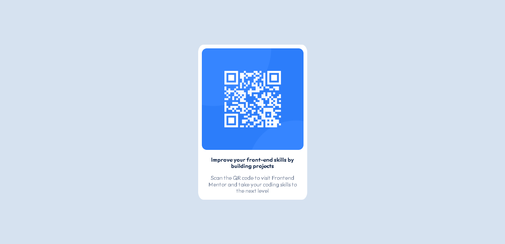

# Frontend Mentor - QR code component

# Frontend Mentor - QR code component solution

This is a solution to the [QR code component challenge on Frontend Mentor](https://www.frontendmentor.io/challenges/qr-code-component-iux_sIO_H). Frontend Mentor challenges help you improve your coding skills by building realistic projects. 

## Table of contents

- [Frontend Mentor - QR code component](#frontend-mentor---qr-code-component)
- [Frontend Mentor - QR code component solution](#frontend-mentor---qr-code-component-solution)
  - [Table of contents](#table-of-contents)
  - [Overview](#overview)
    - [Screenshot](#screenshot)
    - [Links](#links)
  - [My process](#my-process)
    - [Built with](#built-with)
    - [What I learned](#what-i-learned)
  - [Author](#author)

## Overview

### Screenshot

### Links

- Solution URL: [Frontendmentor](https://www.frontendmentor.io/solutions/frontend-mentor-qr-code-component-7nW8TQCbS)
- Live Site URL: [Frontend-Mentor-QR-code-component](https://vanestefani.github.io/Frontend-Mentor-QR-code-component/)

## My process

### Built with

- Semantic HTML5 markup
- CSS custom properties
- Flexbox

### What I learned

I learned the use of variables in css and center elements with flexbox

## Author

- Frontend Mentor - [@Vanestefani](https://www.frontendmentor.io/profile/Vanestefani)
- Twitter - [@DEVANESTEFANI](https://twitter.com/DEVANESTEFANI)